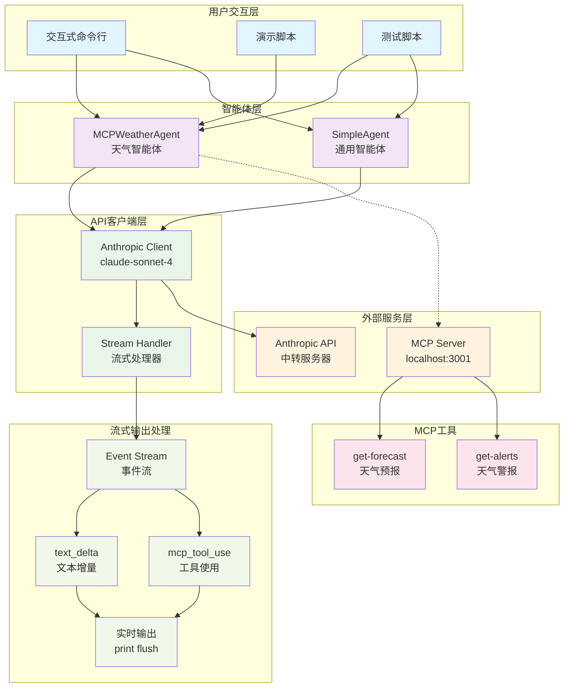
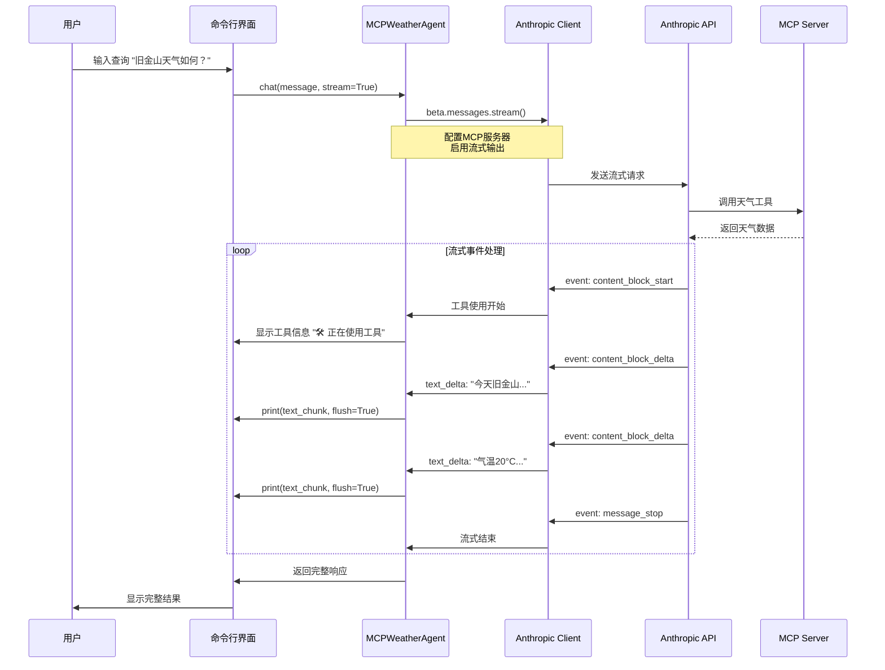
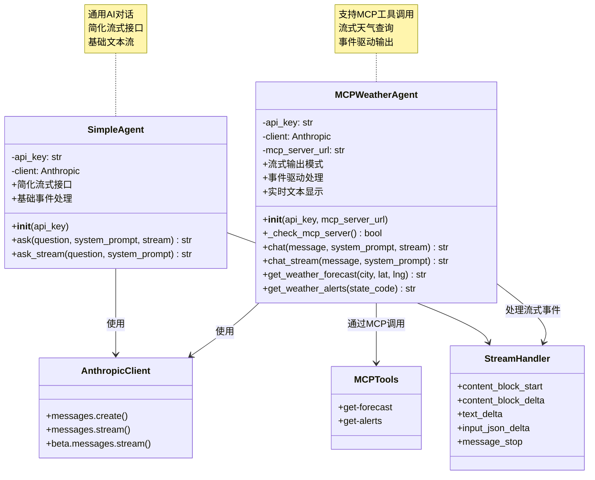

# Agent.py 架构文档

## 📋 项目概述

这是一个支持流式输出的智能AI助手系统，包含天气查询和通用对话功能。主要特性：

- 🌤️ **MCP天气智能体**：集成天气预报和警报工具
- 🤖 **通用智能体**：支持各种AI对话任务
- 🔄 **流式输出**：实时响应，提升用户体验
- 🛠️ **工具集成**：通过MCP协议调用外部工具

---

## 🏗️ 整体系统架构



### 架构说明

- **用户交互层**：提供多种交互方式（CLI、演示、测试）
- **智能体层**：核心业务逻辑，支持天气查询和通用对话
- **API客户端层**：处理与Anthropic API的通信和流式输出
- **外部服务层**：MCP服务器和API服务
- **流式输出处理**：实时事件处理和输出显示

---

## 🔄 流式输出时序图



### 流程说明

1. **用户输入**：通过CLI输入天气查询
2. **流式配置**：智能体配置流式请求参数
3. **工具调用**：API调用MCP天气工具
4. **事件循环**：处理流式事件，实时显示输出
5. **完成响应**：返回完整的响应结果

---

## 🏛️ 类结构图



### 类说明

#### MCPWeatherAgent（天气智能体）
- **核心功能**：天气查询、MCP工具集成
- **流式支持**：`chat_stream()` 方法
- **工具调用**：天气预报、天气警报

#### SimpleAgent（通用智能体）
- **核心功能**：通用AI对话
- **流式支持**：`ask_stream()` 方法
- **简化接口**：易于使用的API

---

## 🔧 核心技术特性

### 1. 流式输出实现
```python
# 关键代码片段
for event in stream:
    if event.type == "content_block_delta":
        if event.delta.type == "text_delta":
            print(event.delta.text, end="", flush=True)
```

### 2. 支持的事件类型
- `content_block_start` - 内容块开始
- `content_block_delta` - 增量内容更新
  - `text_delta` - 文本增量
  - `input_json_delta` - JSON输入增量
- `content_block_stop` - 内容块结束
- `message_stop` - 消息结束

### 3. MCP工具集成
- `get-forecast` - 获取天气预报
- `get-alerts` - 获取天气警报

### 4. 用户体验优化
- 默认启用流式输出
- `/stream` 命令切换模式
- `/help` 帮助系统
- 实时响应显示

---

## 🚀 使用示例

### 基本使用
```python
# 创建智能体
agent = MCPWeatherAgent()

# 流式输出
response = agent.chat("旧金山的天气如何？", stream=True)

# 非流式输出
response = agent.chat("纽约的天气如何？", stream=False)
```

### 交互式使用
```bash
# 运行主程序
python agent.py

# 运行演示
python agent.py demo

# 运行测试
python test_stream.py
```

---

## 📁 文件结构

```
├── agent.py              # 主智能体文件
├── test_stream.py         # 流式输出测试
├── agent_architecture.md # 本架构文档
└── .env                  # 环境变量配置
```

---

## 🎯 技术亮点

1. **双模式支持**：同时支持流式和非流式输出
2. **事件驱动**：基于Anthropic流式事件系统
3. **实时体验**：使用`flush=True`实现实时输出
4. **工具集成**：通过MCP协议无缝集成外部工具
5. **用户友好**：提供命令切换和帮助系统

---

*文档生成时间：2024年*
*基于 agent.py 流式输出架构* 