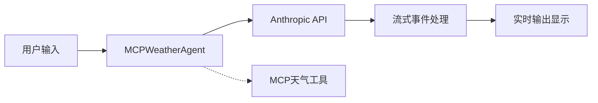

# Agent.py 架构概览

## 🎯 项目简介

**支持流式输出的AI智能助手系统** - 集成天气查询和通用对话功能

---

## 🏗️ 核心架构



### 关键组件

| 组件 | 功能 | 技术实现 |
|------|------|----------|
| **MCPWeatherAgent** | 天气智能体 | MCP协议 + 流式输出 |
| **SimpleAgent** | 通用智能体 | 基础流式对话 |
| **Stream Handler** | 流式处理器 | `for event in stream` |
| **MCP Tools** | 外部工具 | 天气预报 + 警报 |

---

## 🔄 流式输出核心

### 事件处理循环
```python
for event in stream:
    if event.type == "content_block_delta":
        if event.delta.type == "text_delta":
            print(event.delta.text, end="", flush=True)
```

### 支持的事件类型
- `content_block_start` - 内容开始
- `content_block_delta` - 增量更新
- `message_stop` - 消息结束

---

## 📊 技术栈

- **🐍 Python 3.8+** - 核心语言
- **🤖 Anthropic Claude** - AI引擎  
- **🛠️ MCP协议** - 工具集成
- **⚡ 流式输出** - 实时体验

---

## 🚀 快速使用

```python
# 创建智能体
agent = MCPWeatherAgent()

# 流式查询
agent.chat("旧金山天气如何？", stream=True)
```

```bash
# 运行程序
python agent.py

# 命令切换
/stream  # 切换模式
/help    # 显示帮助
```

---

## 📁 文件结构

```
├── agent.py                # 🎯 主程序
├── test_stream.py          # 🧪 测试脚本
├── agent_architecture.md   # 📊 详细架构
└── README.md              # 📖 使用说明
```

---

**💡 完整架构详情请查看 `agent_architecture.md`** 