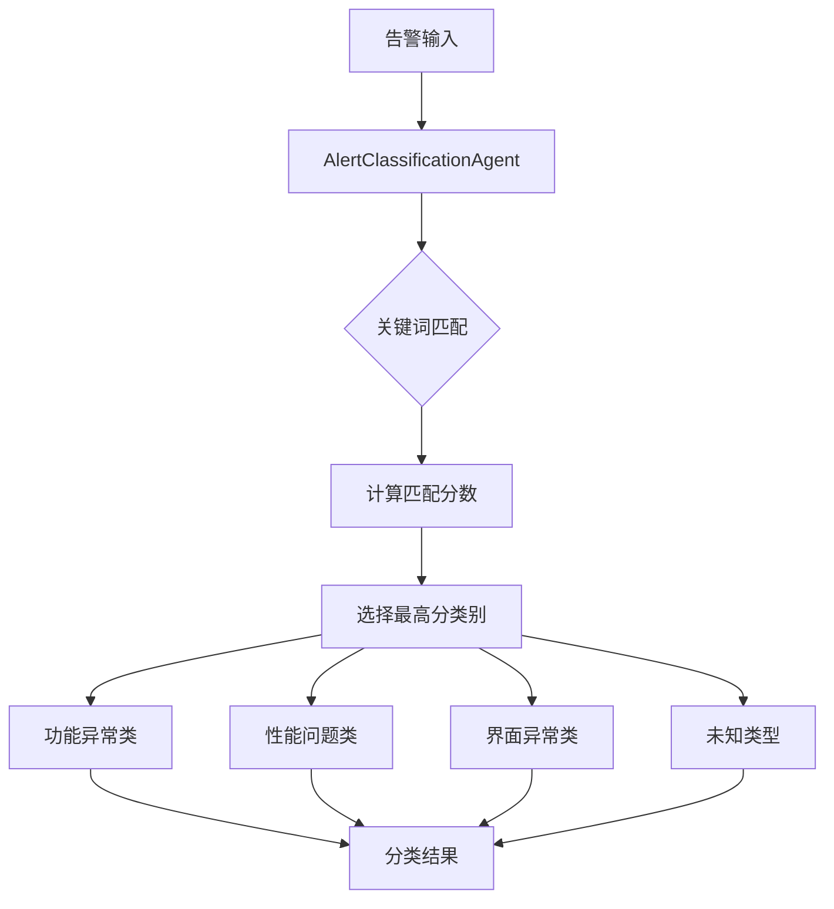
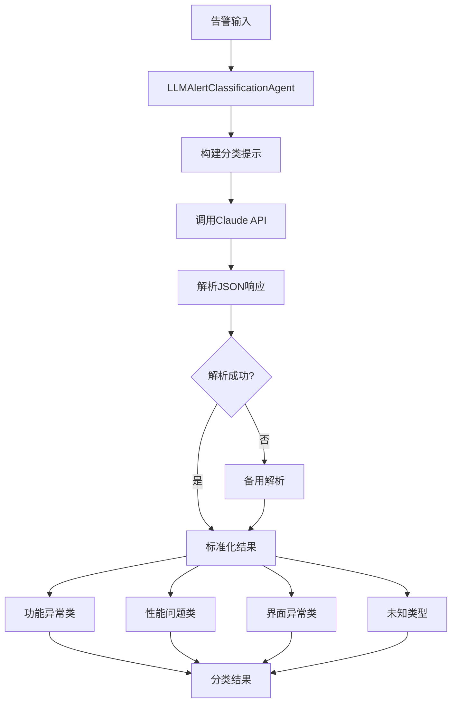
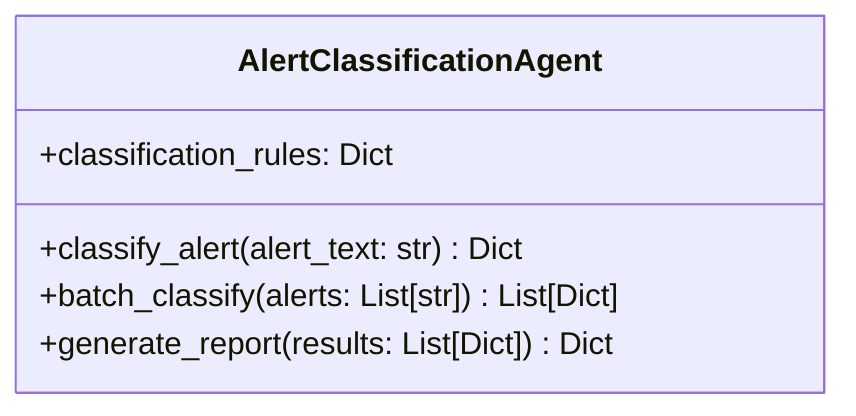
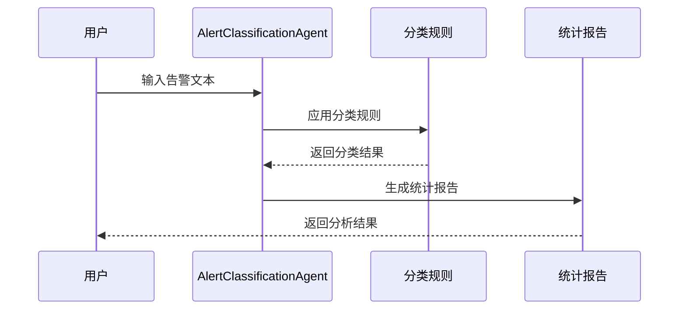

# 金融APP告警分类系统说明

## 系统架构

### 关键词+正则方法


### LLM大模型方法


## 核心组件

### AlertClassificationAgent 类
主要功能类，负责告警分类的核心逻辑。



## 分类规则

系统使用三类规则进行告警分类：

1. **功能异常类**
   - 关键词：失败、无法、错误、异常等
   - 示例：支付失败、登录失败、交易失败

2. **性能问题类**
   - 关键词：慢、卡顿、延迟、超时等
   - 示例：页面加载慢、响应延迟

3. **界面异常类**
   - 关键词：显示、布局、界面、按钮等
   - 示例：界面错位、文字重叠

## 处理流程



## 使用示例

### 关键词版本（传统方法）
```python
# 创建关键词分类器实例
agent = AlertClassificationAgent()

# 单条告警分类
result = agent.classify_alert("用户反馈点击买入按钮后页面无响应")

# 批量分类
results = agent.batch_classify(alerts_list)

# 生成报告
report = agent.generate_report(results)
```

### LLM版本（大模型方法）
```python
# 创建LLM分类器实例
llm_agent = LLMAlertClassificationAgent()

# 单条告警分类
result = llm_agent.classify_alert("用户反馈点击买入按钮后页面无响应")

# 批量分类
results = llm_agent.batch_classify(alerts_list)

# 生成报告
report = llm_agent.generate_report(results)

# 方法对比
comparison = llm_agent.compare_with_keyword_method(alerts_list, keyword_agent)
```

## 输出示例

分类结果包含以下信息：
- 告警文本
- 分类类别
- 置信度
- 分类原因
- 响应时间
- 时间戳
- 详细匹配信息

## 文件说明

- `alert_classification_demo_code.py`: 基于关键词+正则的传统分类方法
- `llm_alert_classification.py`: 基于Claude大模型的智能分类方法

## 方法对比

| 特性 | 关键词+正则方法 | LLM大模型方法 |
|-----|----------------|---------------|
| **响应速度** | 极快（<10ms） | 较慢（1-3秒） |
| **准确率** | 中等（基于规则匹配） | 高（理解语义） |
| **成本** | 免费 | 按调用计费 |
| **可扩展性** | 需手动维护规则 | 自动理解新类型 |
| **置信度** | 基于匹配度计算 | LLM自评估 |
| **解释性** | 明确的关键词匹配 | 详细的分析原因 |

## 性能指标

### 关键词方法
- 平均响应时间：< 10ms
- 高置信度比例：> 70%
- 支持高并发批量处理
- 实时分类能力

### LLM方法
- 平均响应时间：1-3秒
- 高置信度比例：> 85%
- 支持批量处理（有API限制）
- 更准确的语义理解

## LLM版本的核心优势

### 🧠 语义理解
- 能理解复杂的语言表达，不仅仅是关键词匹配
- 理解上下文和语义关系，处理同义词和近义词
- 能够识别隐含的问题类型，即使没有明确的关键词

### 🔄 自动学习
- 无需手动维护规则，能适应新的告警类型
- 自动理解行业术语和专业表达
- 随着模型更新自动提升分类能力

### 📝 详细分析
- 提供详细的分类原因和分析过程
- 识别并返回关键词和分析依据
- 给出具体的置信度评估和解释

### 🎯 高准确率
- 通过大模型的语言理解能力提供更准确的分类
- 减少误分类和边界案例的处理错误
- 对模糊描述有更好的判断能力

### 💡 适用场景
LLM版本特别适合处理：
- 复杂、模糊或新型的告警描述
- 包含多种问题类型的复合告警
- 需要语义理解的非标准化描述
- 要求高准确率的关键业务场景

能够提供更智能和准确的分类结果！ 