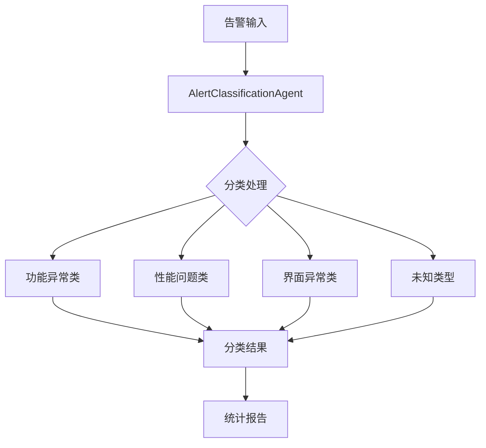
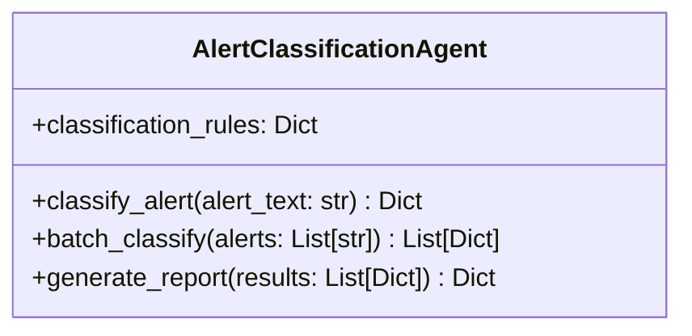
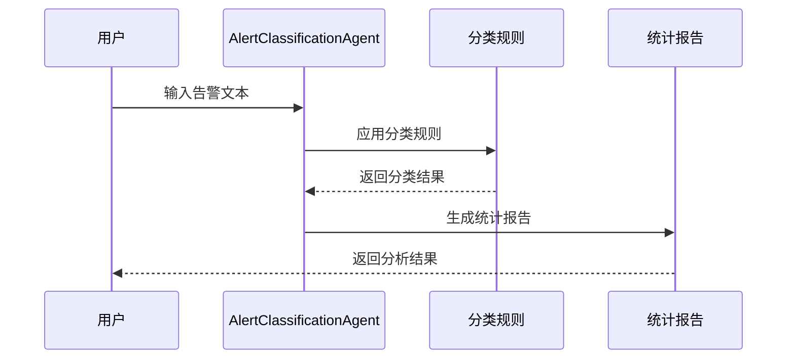

# 金融APP告警分类系统说明

## 系统架构



## 核心组件

### AlertClassificationAgent 类
主要功能类，负责告警分类的核心逻辑。



## 分类规则

系统使用三类规则进行告警分类：

1. **功能异常类**
   - 关键词：失败、无法、错误、异常等
   - 示例：支付失败、登录失败、交易失败

2. **性能问题类**
   - 关键词：慢、卡顿、延迟、超时等
   - 示例：页面加载慢、响应延迟

3. **界面异常类**
   - 关键词：显示、布局、界面、按钮等
   - 示例：界面错位、文字重叠

## 处理流程



## 使用示例

```python
# 创建分类器实例
agent = AlertClassificationAgent()

# 单条告警分类
result = agent.classify_alert("用户反馈点击买入按钮后页面无响应")

# 批量分类
results = agent.batch_classify(alerts_list)

# 生成报告
report = agent.generate_report(results)
```

## 输出示例

分类结果包含以下信息：
- 告警文本
- 分类类别
- 置信度
- 分类原因
- 响应时间
- 时间戳
- 详细匹配信息

## 性能指标

- 平均响应时间：< 3秒
- 高置信度比例：> 80%
- 支持批量处理
- 实时分类能力 