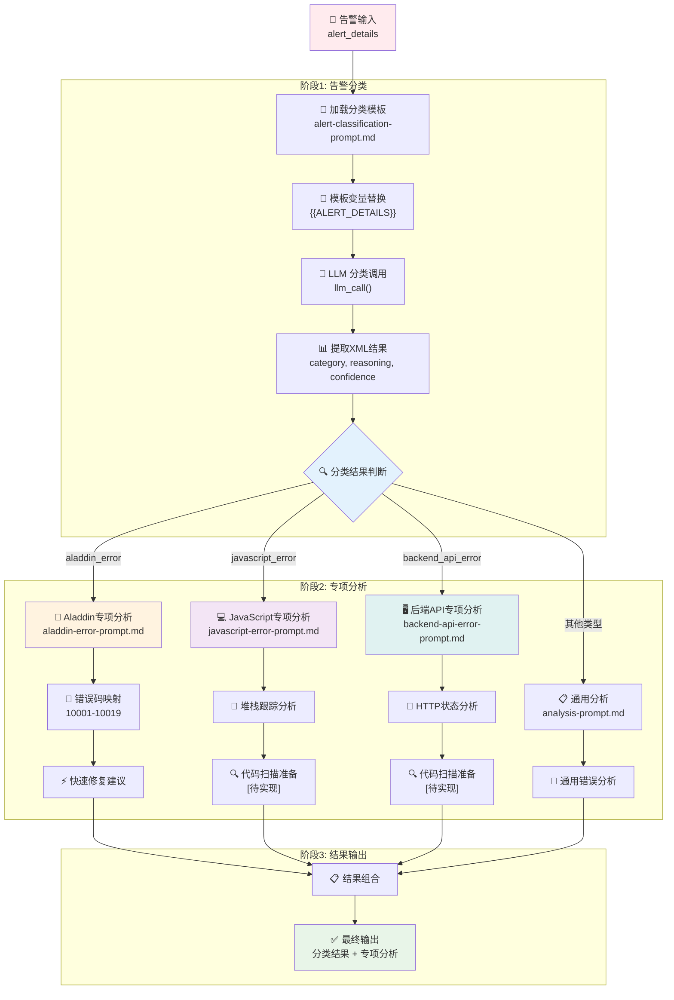
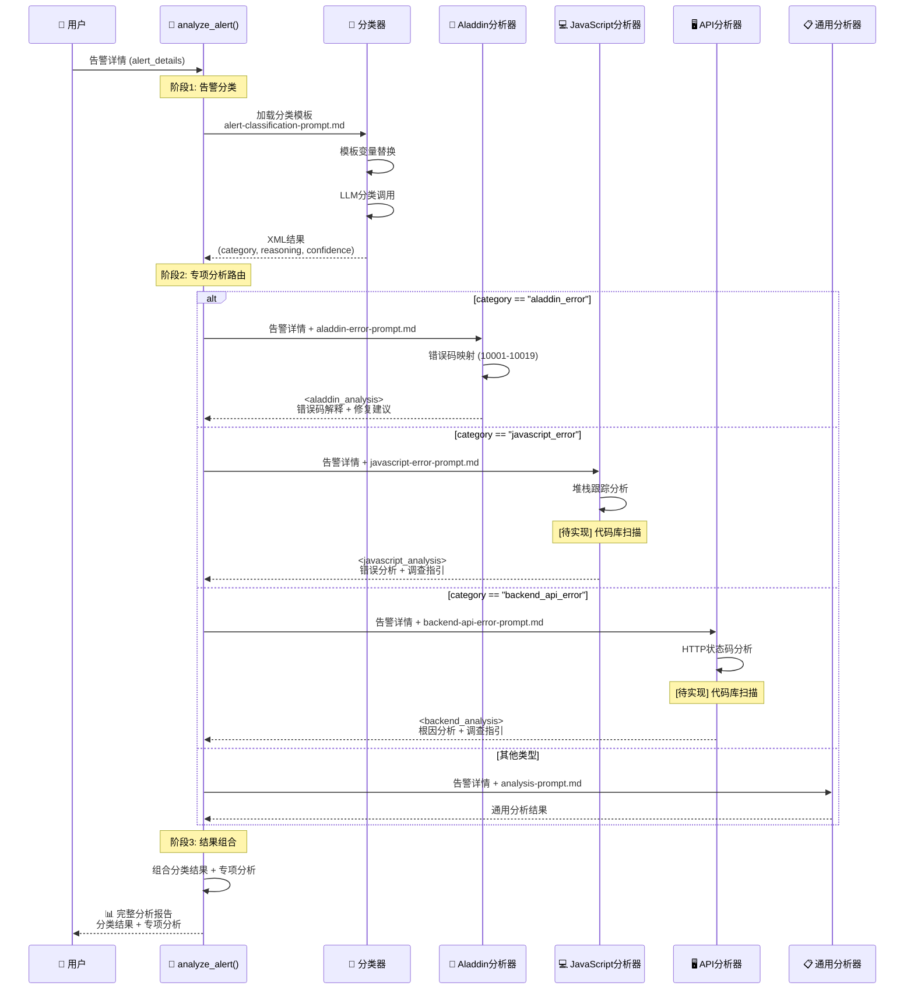
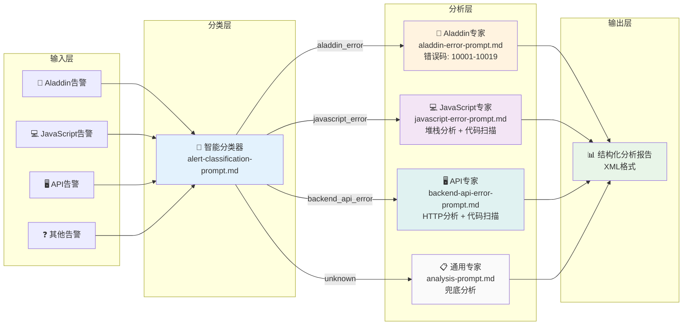

# Crisis Agent - analyze_alert 工作流程详解

## 概述

`analyze_alert` 是 Crisis Agent 智能告警分析系统的核心函数，采用**两阶段流水线架构**，能够智能分类告警并提供专业的分析结果。

## 函数签名

```python
def analyze_alert(alert_details: str) -> str:
    """
    Analyze alert by first classifying it, then applying appropriate specialized analysis.
    
    Args:
        alert_details: The alert information to analyze
        
    Returns:
        Comprehensive analysis based on alert category
    """
```

## 完整工作流程

### 主流程图



### 数据流时序图



### 系统架构图



## 详细阶段分解

### 阶段 1：告警分类 🔍

#### 步骤详解

1. **加载分类模板**
   ```python
   with open('crisis/alert-classification-prompt.md', 'r', encoding='utf-8') as f:
       classification_prompt = f.read().replace('{{ALERT_DETAILS}}', alert_details)
   ```

2. **LLM 分类调用**
   ```python
   classification_response = llm_call(classification_prompt)
   ```

3. **提取结构化结果**
   ```python
   category = extract_xml(classification_response, 'category').strip().lower()
   reasoning = extract_xml(classification_response, 'reasoning')
   confidence = extract_xml(classification_response, 'confidence')
   ```

#### 输出格式
```xml
<classification>
<category>aladdin_error</category>
<reasoning>发现Aladdin相关关键词和错误码特征</reasoning>
<confidence>高</confidence>
</classification>
```

### 阶段 2：专项分析 🔧

#### Aladdin 错误处理 (`aladdin_error`)
- **模板文件**: `crisis/aladdin-error-prompt.md`
- **核心特性**: 内置错误码映射 (10001-10019)
- **处理逻辑**: 快速错误码解释和修复建议
- **输出格式**: `<aladdin_analysis>`

#### JavaScript 错误处理 (`javascript_error`)
- **模板文件**: `crisis/javascript-error-prompt.md`
- **核心特性**: 堆栈跟踪分析和代码调查指引
- **处理逻辑**: 详细错误分析 + 代码扫描准备
- **输出格式**: `<javascript_analysis>`
- **待实现**: 代码库扫描功能

#### 后端 API 错误处理 (`backend_api_error`)
- **模板文件**: `crisis/backend-api-error-prompt.md`
- **核心特性**: HTTP 状态码分析和服务影响评估
- **处理逻辑**: 根因分析 + 代码扫描准备
- **输出格式**: `<backend_analysis>`
- **待实现**: 代码库扫描功能

#### 通用错误处理 (兜底)
- **模板文件**: `crisis/analysis-prompt.md`
- **用途**: 处理未知类别的告警
- **处理逻辑**: 通用错误分析

### 阶段 3：结果组合 📋

最终输出包含两部分：
1. **分类结果**: 类别、置信度、分类依据
2. **专项分析**: 基于类型的详细分析

```
=== 告警分类结果 ===
类别: javascript_error
置信度: 高
分类依据: 发现JavaScript相关关键词和错误特征

=== 专项分析结果 ===
<javascript_analysis>
...详细分析内容...
</javascript_analysis>
```

## 支持的告警类型

| 类型 | 描述 | 关键特性 | 触发关键词 |
|------|------|----------|------------|
| `aladdin_error` | Aladdin JS Bridge 通信错误 | 内置错误码映射 (10001-10019) | aladdin, bridge, 桥接, 移动端 |
| `javascript_error` | 前端 JavaScript 运行时错误 | 堆栈跟踪分析 | JavaScript, JS, TypeError, ReferenceError |
| `backend_api_error` | 服务端 API 系统错误 | HTTP 状态分析 | API, 接口, 服务器, 数据库, 超时 |

## 使用示例

### 基本用法

```python
from crisis.workflow import analyze_alert

# Aladdin 错误示例
alert_details = """
告警时间: 2024-01-15 14:30:22
错误信息: Aladdin bridge call failed with error code 10015
设备型号: iPhone 14 Pro
"""

result = analyze_alert(alert_details)
print(result)
```

### 测试用例

可以使用 `crisis/example_usage.py` 进行测试：

```bash
# 测试所有类型
python crisis/example_usage.py

# 测试特定类型
python crisis/example_usage.py aladdin
python crisis/example_usage.py javascript
python crisis/example_usage.py backend
```

## 核心优势

1. **🎯 智能分类**: 自动识别告警类型，无需手动指定
2. **🔧 专业分析**: 每种类型都有定制化的分析逻辑
3. **📋 结构化输出**: XML 格式，便于后续处理和集成
4. **🚀 可扩展性**: 轻松添加新的告警类型和分析逻辑
5. **📝 模板化设计**: 易于维护和更新分析提示

## 技术特点

- **模板化提示**: Markdown 模板 + 变量替换
- **两阶段 LLM 流水线**: 分类 → 专业分析
- **结构化 XML 输出**: 一致的可解析分析结果
- **模式匹配**: 关键词和错误码智能识别

## 未来增强计划

- **📁 代码库扫描**: JavaScript 和 Backend 错误的代码仓库分析
- **📚 历史案例匹配**: 基于模式的相似性匹配
- **🔧 自动修复建议**: 代码级别的修复推荐
- **📊 分析质量评估**: 分析结果的准确性评估机制

## 相关文件

- **主工作流**: `crisis/workflow.py`
- **分类提示**: `crisis/alert-classification-prompt.md`
- **专业分析提示**: 
  - `crisis/aladdin-error-prompt.md`
  - `crisis/javascript-error-prompt.md`
  - `crisis/backend-api-error-prompt.md`
- **测试示例**: `crisis/example_usage.py`
- **配置文件**: `crisis/config.py`
- **工具函数**: `crisis/util.py` 