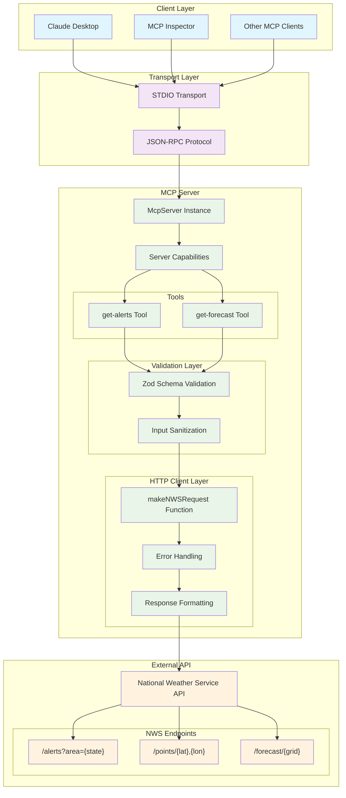

# Weather MCP Server

一个基于 Model Context Protocol (MCP) 的天气服务器，提供美国天气预报和告警信息。

## 🌟 功能特性

- 🌤️ **天气预报**：根据经纬度获取详细的天气预报
- ⚠️ **天气告警**：查询美国各州的活跃天气警报
- 🔧 **TypeScript 支持**：完全使用 TypeScript 开发
- 🚀 **MCP 兼容**：支持 Model Context Protocol 标准

## 🏗️ 系统架构



### 架构说明

**🔵 客户端层 (Client Layer)**
- 支持多种 MCP 客户端：Claude Desktop、MCP Inspector、自定义客户端

**🟣 传输层 (Transport Layer)**  
- 使用 STDIO 传输，通过标准输入输出进行通信
- 基于 JSON-RPC 协议进行消息传递

**🟢 MCP 服务器层 (MCP Server)**
- **工具层**：提供 `get-alerts` 和 `get-forecast` 两个核心工具
- **验证层**：使用 Zod 进行输入验证和类型安全
- **HTTP 客户端层**：处理与外部 API 的通信、错误处理和响应格式化

**🟠 外部 API 层 (External API)**
- 集成美国国家气象局 API
- 支持天气警报、位置查询和预报数据获取

## 📋 前置要求

- Node.js 18+ 
- npm 或 yarn
- TypeScript 5.8+

## 🚀 安装与运行

### 1. 安装依赖

```bash
npm install
```

### 2. 编译 TypeScript

```bash
npm run build
```

### 3. 运行服务器

```bash
# 开发模式（支持热重载）
npm run dev

# 生产模式
npm start

# 直接运行编译后的文件
node build/index.js
```

## 🛠️ 可用工具

### `get-forecast`
获取指定位置的天气预报

**参数：**
- `latitude` (number): 纬度 (-90 到 90)
- `longitude` (number): 经度 (-180 到 180)

**示例：**
```json
{
  "latitude": 37.7749,
  "longitude": -122.4194
}
```

### `get-alerts`
获取美国各州的天气告警

**参数：**
- `state` (string): 两位州代码（如：CA, NY, TX）

**示例：**
```json
{
  "state": "CA"
}
```

## 🔍 使用 MCP Inspector 调试

### 1. 启动 Inspector

```bash
npx @modelcontextprotocol/inspector node mcp-demo/build/index.js
```

### 2. 配置 Inspector

在 Inspector 界面中：

- **Transport Type**: `STDIO`
- **Command**: `node`
- **Arguments**: `mcp-demo/build/index.js`

### 3. 测试工具

连接成功后，在 **Tools** 标签页中测试：

**测试天气预报：**
- 工具：`get-forecast`
- 参数：
  ```json
  {
    "latitude": 37.7749,
    "longitude": -122.4194
  }
  ```

**测试天气告警：**
- 工具：`get-alerts`
- 参数：
  ```json
  {
    "state": "CA"
  }
  ```

## 🏗️ 开发指南

### 项目结构

```
mcp-demo/
├── src/
│   └── index.ts          # 主入口文件
├── build/                # 编译输出目录
├── package.json          # 项目配置
├── tsconfig.json         # TypeScript 配置
└── README.md            # 项目文档
```

### 脚本命令

```bash
# 开发模式（热重载）
npm run dev

# 生产模式
npm start

# 编译 TypeScript
npm run build

# 运行测试
npm test
```

### TypeScript 配置

项目使用 ESM 模块系统，关键配置：

```json
{
  "compilerOptions": {
    "target": "ES2022",
    "module": "NodeNext",
    "moduleResolution": "NodeNext"
  },
  "ts-node": {
    "esm": true
  }
}
```

## 🌐 与 Claude Desktop 集成

在 Claude Desktop 中配置此服务器：

```json
{
  "mcpServers": {
    "weather": {
      "command": "node",
      "args": [
        "/绝对路径/到/mcp-demo/build/index.js"
      ]
    }
  }
}
```

## 📊 数据源

本项目使用 [National Weather Service API](https://api.weather.gov)：
- 免费且无需 API 密钥
- 仅支持美国地区
- 提供详细的天气预报和告警信息

## ⚡ 故障排除

### TypeScript ESM 错误
如果遇到 `ERR_UNKNOWN_FILE_EXTENSION` 错误：
1. 确保 `package.json` 中有 `"type": "module"`
2. 使用 `npm start` 而不是直接运行 `ts-node`

### Inspector 连接失败
1. 确保路径使用 `mcp-demo/build/index.js`
2. 先运行 `npm run build` 编译代码
3. 检查服务器是否能独立运行

### API 请求失败
- 确保网络连接正常
- 仅支持美国坐标范围
- NWS API 可能有速率限制

## 📄 许可证

ISC License

## 🤝 贡献

欢迎提交 Issue 和 Pull Request！ 